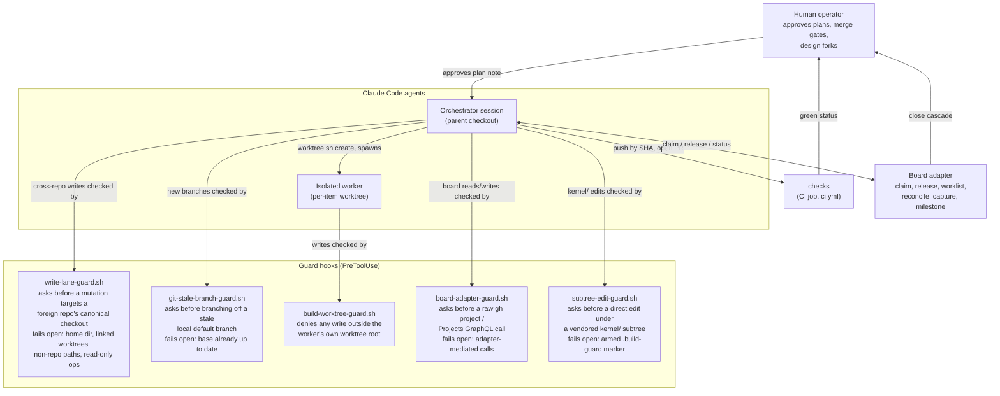
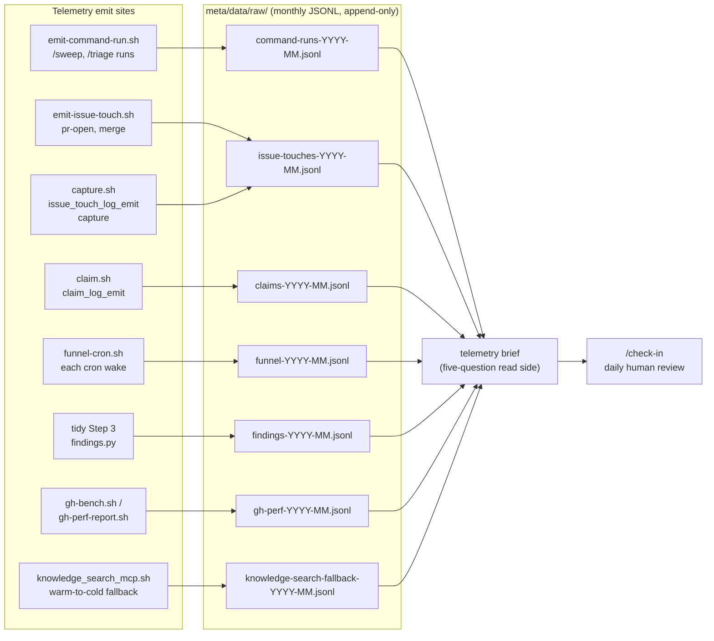

# Architecture overview

This page is the "how all the pieces work together" map of TemperLoop: one
issue's trip from a board's Backlog to a merged pull request, who (or what)
touches it along the way, and where the telemetry that trip leaves behind
ends up. It ties together the pieces introduced in [`README.md`](../README.md)
§1 ("What TemperLoop is") and §4 ("Repo layout") without restating either —
read this page for the shape of the system, and the linked command/contract
files for the mechanics of one piece.

All three diagrams below are [Mermaid](https://mermaid.js.org) fenced code
blocks. GitHub renders Mermaid natively in any Markdown file it displays —
that rendering is this page's canonical view; no build step or script this
repo ships is required to see them. `make docs` (§6 of the
README) does not process this file at all: like
[`docs/managed-merge-queue.md`](managed-merge-queue.md) and
[`docs/config-precedence.md`](config-precedence.md), this is a hand-maintained
standalone doc, not one of the three generated sources the docs-site
generator (`workflows/scripts/docs/generate.py`) renders — so the generator
stays zero-network and zero-install (stdlib-only Markdown, no Mermaid
runtime) with nothing extra to wire up here.

## 1. Pipeline flow

One issue's path from Backlog to a merged, closed PR. Triage splits survivors
into two parallel tracks — grouped work becomes an **epic** with native
sub-issues and goes through `/assess` for dependency-ordered decomposition;
an issue triage leaves **ungrouped** (a singleton) skips straight to
`/sweep`, which folds `/assess`'s missing pre-execution clarification step
into its own upfront question sweep. A separate, second front door,
`/design`, feeds the same epic shape for **invented** work (an idea born in
conversation, never a Backlog item) via its own intake → coverage walk →
ratify → materialize flow. All tracks converge on the same per-item
execution mechanics: an isolated worktree, a worker, a PR, CI, and a merge
gate.

```mermaid
flowchart LR
    Issue["GitHub issue<br/>(board Backlog)"] --> Triage["/triage<br/>cull, collapse, group"]
    Conversation["A design conversation<br/>(invented work)"] --> Design["/design<br/>coverage walk, ratify, materialize"]
    Triage --> Epic["Epic<br/>(parent issue + native sub-issues)"]
    Design --> Epic
    Triage --> Singleton["Ready singleton<br/>(ungrouped issue)"]
    Epic --> Assess["/assess --epic N"]
    Assess --> Plan["Plan note<br/>(Plans/, dependency-ordered)"]
    Plan --> Build["/build<br/>(per dependency level)"]
    Singleton --> Sweep["/sweep<br/>(one issue at a time)"]
    Build --> Worker["Worktree-isolated worker<br/>(one worktree + branch per item)"]
    Sweep --> Worker
    Worker --> PR["Pull request"]
    PR --> Checks["checks<br/>(CI job)"]
    Checks --> Gate["Merge gate<br/>(NATIVE or MANAGED queue)"]
    Gate --> Merged["Merged to main"]
    Merged --> Cascade["Closes issue -> board Done cascade"]
    Cascade --> EpicClose["Epic closes when last<br/>open sub-issue closes"]
```

A few things this diagram compresses that are worth naming explicitly:

- **`/triage`** runs the logical decision tree — cull, root-cause collapse,
  group-by-meaning, value/priority — over a board's Backlog, then
  materialises survivors as board-native epics (parent issue + sub-issues)
  or leaves an ungrouped survivor as a Ready singleton. This is the funnel's
  front door for **discovered** work; nothing downstream re-decides what
  survives.
- **`/design`** is the funnel's second front door, for **invented** work —
  an idea that starts as "we should build X" with no Backlog item behind
  it. It walks a fixed coverage template (`claude/design-schema.md`)
  instead of triage's decision tree, then materializes a ratified brief
  into the same Contract-bearing epic shape `/triage` produces, plus draft
  ADRs for any architectural calls the brief makes and a `Decisions/` note.
  Nothing downstream of the epic (`/assess` onward) treats a designed epic
  differently from a triaged one.
- **`/assess --epic N`** is the epic path's technical decomposition step: it
  turns an epic into a dependency-ordered plan note under `Plans/`, each
  item scoped to a contract (what it produces, what it consumes, its
  acceptance check) rather than an implementation.
- **`/build`** executes an approved plan note one dependency level at a
  time: every item in a level is isolated into its own worktree and worker,
  runs concurrently within the level, and parks at CI-green for a single
  **batched merge gate** at the end of the level — not a gate per item.
- **`/sweep`** is the singleton-path peer to `/build`: it drains Ready
  issues that are *not* a sub-issue of any epic, one at a time, reusing the
  same per-item worktree/worker/PR/CI mechanics but with no dependency
  levels and no batching.
- **The merge gate** selects a **NATIVE** GitHub merge queue where the
  repo's branch ruleset actually has one armed, or falls back to a
  **MANAGED** queue that replicates the same re-validate-then-merge
  semantics serially, per PR, on a repo with no native queue at all (a
  free/personal repo, for instance). Either path confirms the PR reached
  `state=="MERGED"` before anything downstream treats the work as landed —
  see [`docs/managed-merge-queue.md`](managed-merge-queue.md) (README §9)
  for the full backend-selection algorithm and why "queued" and "merged"
  are deliberately kept distinct.
- **The close-Done cascade** moves a merged item's board card to Done
  automatically once its issue closes (via the PR's `Closes #N`); an epic
  closes itself once its last open sub-issue closes. Neither is a step a
  command performs by hand — both are consequences of the issue graph
  reaching a terminal state.

## 2. Actor and guard map

TemperLoop's process guarantees are enforced mechanically, not by
convention alone: a small set of PreToolUse hooks sit at every seam where an
agent's action could otherwise cross a boundary it shouldn't — writing into
another checkout, branching off a stale base, escaping a worker's worktree,
bypassing the board's rate-limited API, or editing a vendored copy of this
kernel directly. Each guard is independently armed and **fails open** on
everything outside the one risk it targets, so a guard's absence-of-firing
is not itself a safety signal for anything but that one seam.

- **`write-lane-guard.sh`** backs the working-tree-ownership rule: a session
  mutates only the working tree it was launched in (plus any linked
  worktree). It intercepts a state-mutating `Bash`/`Edit`/`Write`/
  `MultiEdit`/`NotebookEdit` call whose target resolves to the *main*
  working tree of a repo other than the session's own, and asks rather than
  silently proceeding — but stays silent for the home checkout, any linked
  worktree, non-repo paths, `git worktree add` itself, and all read-only
  operations.
- **`git-stale-branch-guard.sh`** backs "fetch ground truth before
  building": it intercepts `git checkout -b` / `git switch -c` off a local
  default branch, fetches `origin`, and asks — naming how far behind — when
  the local base is stale. It fires only on the genuinely-stale case;
  branching directly off `origin/<default>`, or off an already up-to-date
  local base, stays silent.
- **`build-worktree-guard.sh`** is the mechanical write-isolation jail for
  build/sweep workers: it self-arms via a `.build-guard` marker that
  `worktree.sh create` drops in each pre-created per-item worktree, then
  structurally **denies** (not asks) any `Edit`/`Write`/`MultiEdit` that
  resolves outside that worktree's root. Unlike the other four guards this
  one is a hard deny, not a confirmation prompt — a worker has no path to
  leak a write into the parent checkout or a sibling worktree.
- **`board-adapter-guard.sh`** protects the board's shared GraphQL rate
  budget: it asks before a raw `gh project` call or hand-rolled Projects
  GraphQL query that bypasses the board adapter (`board.sh` and its
  `claim`/`release`/`worklist`/`reconcile`/`capture`/`milestone` commands),
  which caches across processes and keeps single-item operations off the
  expensive whole-board page.
- **`subtree-edit-guard.sh`** protects a downstream checkout that vendors
  this kernel via a `kernel/` git subtree (or a compat symlink to one) from
  drifting silently: it asks before a direct edit lands there instead of
  upstream in this repo, consistent with the kernel-vs-overlay routing rule
  that a kernel contract is fixed upstream first, never patched only in a
  vendored copy.

These five are the write/action seam guards; the full hook inventory
(including the session-lifecycle and telemetry-emit hooks that don't gate a
write) is catalogued in [`claude/hooks/README.md`](../claude/hooks/README.md),
along with the eval-profile contract that governs how each one behaves
under an automated eval run.

## 3. Telemetry lake

Every mechanically interesting event in the pipeline above — a command run,
an issue touched, a claim taken, a cron wake, a `/tidy` extraction, a `gh`
call's timing, a knowledge-search fallback — is appended as one JSON line to
a monthly-rotated file under `meta/data/raw/`. The lake is append-only and
gitignored: nothing in it is committed, and each host only sees the records
it personally emitted (absent a separate cross-host ingest step). The full
per-stream schema for every stream below lives in
[`meta/data/raw/README.md`](../meta/data/raw/README.md); this diagram is the
map from emit site to stream to read side.

- **`command-run`** — one record per `/sweep` or `/triage` run (the two
  commands with no plan-note footer of their own to carry this signal).
- **`issue-touches`**, with its **`claims`** sibling stream (unioned at read
  time) — every `pr-open` / `merge` / `capture` touch on an issue, plus
  every board claim, giving a full touch history per issue.
- **`funnel`** — one record per autonomous funnel cron wake, heterogeneous
  by `event` (`skipped`, `ran`, `drive`).
- **`findings`** — one record per extraction `/tidy` Step 3 makes from a
  session stub, whether found via a lexicon tell or a model skim, with
  whether it became a real tracked artifact.
- **`gh-perf`** — per-(run, op-class) `gh`-call timing summaries, the
  before/after measurement surface for comparing API backends.
- **`knowledge-search-fallback`** — one record per session the first time a
  knowledge-search call falls back from its warm backend to a slower cold
  path, so a down daemon degrading every search is a durable, alertable
  signal rather than a swallowed per-query stderr line.

The read side is `/check-in`'s daily status readout, which leads with a
telemetry brief rendered from these streams (an overlay-provided renderer in
a composed install; a kernel-only checkout skips that one section with a
one-line note and reviews the rest of `/check-in` as normal) — and, on
demand, the same brief as a `telemetry` skill invocation mid-session. Both
are pure readers: nothing in this pipeline mutates a raw-lake file once
written.
